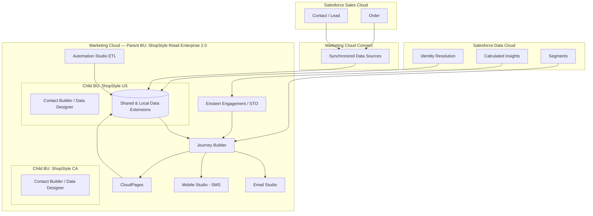
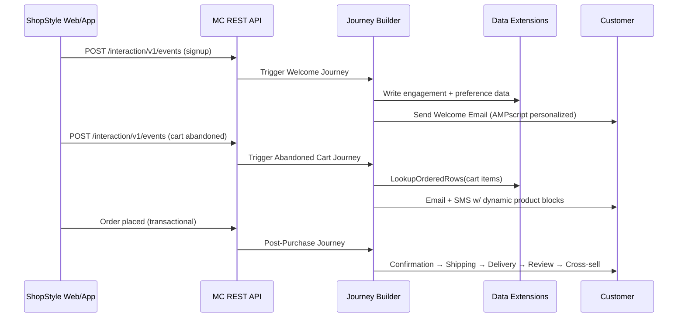

# ShopStyle Retail — Enterprise Salesforce Marketing Cloud Implementation

> Production-grade Salesforce Marketing Cloud (SFMC) implementation for **ShopStyle Retail**, a fictional
> Fortune-100-scale apparel & accessories retailer. This repository contains the full source-artifact
> implementation of an enterprise SFMC program: data architecture, journeys, automations, CloudPages,
> integrations, Data Cloud / Einstein, and reporting — delivered as the actual configuration, code, and
> documentation a Marketing Cloud technical architect would hand off to a client engineering team.

[]()
[]()
[]()

---

## Table of Contents

1. [Architecture](#architecture)
2. [Features](#features)
3. [Folder Structure](#folder-structure)
4. [Prerequisites](#prerequisites)
5. [Installation](#installation)
6. [Deployment](#deployment)
7. [Business Flow](#business-flow)
8. [Screenshots](#screenshots)
9. [Documentation](#documentation)
10. [Future Enhancements](#future-enhancements)

---

## Architecture

ShopStyle Retail runs a **Parent/Child Business Unit** model in Marketing Cloud, backed by a Data
Designer contact model (Contact Builder), synchronized to Sales Cloud via Marketing Cloud Connect, and
enriched by Salesforce Data Cloud for identity resolution and Einstein scoring.



Full architecture set: [`architecture/`](architecture/), diagrams: [`architecture/diagrams/`](architecture/diagrams/).

## Features

| Phase | Capability | Location |
|---|---|---|
| 1 | Enterprise data architecture, BUs, Contact Builder, sender authentication | [`architecture/`](architecture/), [`sql/`](sql/) |
| 2 | Welcome journey (API entry, AMPscript personalization) | [`journeys/welcome/`](journeys/welcome/) |
| 3 | Abandoned cart (triggered REST entry, product recovery, SMS) | [`journeys/abandoned-cart/`](journeys/abandoned-cart/) |
| 4 | Post-purchase lifecycle (confirmation → delivery → review → cross-sell) | [`journeys/post-purchase/`](journeys/post-purchase/) |
| 5 | Birthday & loyalty tier automation, A/B testing | [`journeys/birthday-loyalty/`](journeys/birthday-loyalty/) |
| 6 | Winback / re-engagement / sunset policy | [`journeys/winback/`](journeys/winback/) |
| 7 | Automation Studio ETL (import/export/SQL/script/PGP/scheduling) | [`automation-studio/`](automation-studio/) |
| 8 | CloudPages (preference center, smart capture, subscription mgmt) | [`cloudpages/`](cloudpages/) |
| 9 | Marketing Cloud Connect ↔ Sales Cloud | [`mc-connect/`](mc-connect/) |
| 10 | Salesforce Data Cloud & Einstein | [`data-cloud/`](data-cloud/), [`einstein/`](einstein/) |
| 11 | Reporting & deliverability monitoring | [`sql/reporting/`](sql/reporting/), [`deliverability/`](deliverability/) |

## Folder Structure

```
ShopStyle-SFMC/
├── architecture/          Data model, BU strategy, sender auth, diagrams
├── journeys/               Journey Builder JSON exports per program
├── automation-studio/       SQL/Script/Import/Export/File Transfer automations
├── sql/                     Data Extension SQL, segmentation, reporting queries
├── ampscript/                Shared AMPscript snippets (email + CloudPages)
├── cloudpages/                Preference center, profile update, smart capture
├── ssjs/                       Server-side JavaScript (CloudPages + Automation)
├── api/                         REST/SOAP integration specs + mock server
├── mc-connect/                   Sales Cloud synchronization configuration
├── data-cloud/                    Identity resolution, calculated insights, segments
├── einstein/                       Engagement scoring, content selection, STO
├── deliverability/                  Bounce/spam monitoring & alerting
├── deployment/                       Deployment scripts & checklists
├── docs/                               Architecture, runbook, security, API docs
├── email-templates/                    HTML + AMPscript email templates
├── postman/                             Postman collections & environments
├── sample-data/                          CSV/JSON sample datasets
├── config/                                Environment-driven configuration
└── tests/                                  SQL validation, journey/API/CloudPage tests
```

## Prerequisites

- Salesforce Marketing Cloud account with:
  - Enterprise 2.0 license (Parent + Child Business Units)
  - Contact Builder, Automation Studio, Journey Builder, Mobile Studio, CloudPages enabled
  - Installed Package with Server-to-Server + Web App integration (REST/SOAP)
- Salesforce Sales Cloud org connected via Marketing Cloud Connect
- Salesforce Data Cloud provisioned and connected to the same Salesforce org
- Node.js 18+ (mock API server, tooling scripts)
- [Postman](https://www.postman.com/) for API collection execution
- Git + GitHub CLI (`gh`)

## Installation

```bash
git clone https://github.com/<your-org>/ShopStyle-SFMC.git
cd ShopStyle-SFMC

# Install mock server + tooling dependencies
cd api/mock-server && npm install && cd ../..

# Copy environment template and fill in your SFMC credentials
cp config/config.example.json config/config.json
```

See [`docs/configuration-guide.md`](docs/configuration-guide.md) for full field-by-field configuration.

## Deployment

Deployment is metadata-driven: Data Extensions, Journeys, Automations, and CloudPages are deployed via
the SFMC REST/SOAP Deploy Manager APIs and scripted through `deployment/scripts/`. See the full runbook:

- [`docs/deployment-guide.md`](docs/deployment-guide.md)
- [`deployment/checklist.md`](deployment/checklist.md)

Quick start (after configuring `config/config.json`):

```bash
node deployment/scripts/deploy-data-extensions.js
node deployment/scripts/deploy-automations.js
node deployment/scripts/deploy-cloudpages.js
node deployment/scripts/validate-deployment.js
```

## Business Flow



## Screenshots

> Real SFMC UI screenshots are added post-deployment to a sandbox. Placeholders below map to the
> corresponding builder screen.

| Screenshot | Description |
|---|---|
| `assets/images/journey-welcome.png` | Journey Builder canvas — Welcome Journey |
| `assets/images/contact-builder-model.png` | Contact Builder — Data Designer relationships |
| `assets/images/cloudpage-preference-center.png` | Rendered Preference Center CloudPage |
| `assets/images/automation-etl.png` | Automation Studio — nightly ETL automation |

## Documentation

Full documentation set lives in [`docs/`](docs/):

- [Architecture](docs/architecture.md)
- [API Documentation](docs/api-documentation.md)
- [Deployment Guide](docs/deployment-guide.md)
- [Configuration Guide](docs/configuration-guide.md)
- [Runbook](docs/runbook.md)
- [Troubleshooting Guide](docs/troubleshooting.md)
- [Best Practices](docs/best-practices.md)
- [Security Guide](docs/security-guide.md)

## Future Enhancements

- Extend Einstein Content Selection to mobile push (Mobile Studio)
- Add MobileConnect two-way SMS conversational flows for customer service handoff
- Expand Data Cloud calculated insights to RFM-based lifetime value segmentation
- CI/CD pipeline (GitHub Actions) for automated Automation Studio package deployment
- Multi-language (i18n) email template variants via AMPscript content blocks

---

© ShopStyle Retail — Enterprise Marketing Cloud Program. Internal reference implementation.
