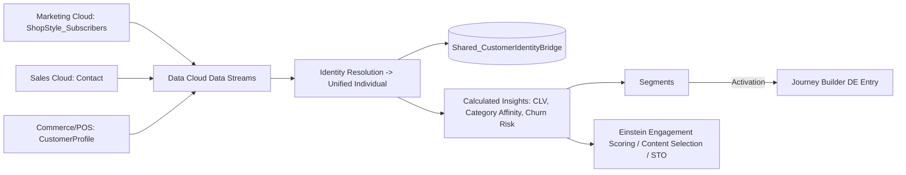

# Salesforce Data Cloud Integration

Data Cloud is the enterprise system of record for **identity resolution** and **calculated insights**
across all ShopStyle data sources (Marketing Cloud, Sales Cloud, POS/commerce). It supersedes the
simple email-exact-match bridge sync described in Phase 9
([`../automation-studio/sql/20-sync-identity-bridge.sql`](../automation-studio/sql/20-sync-identity-bridge.sql))
once fully rolled out — that SQL job remains in place as a same-day fallback for any subscriber not yet
resolved by Data Cloud (e.g., brand-new signups before their first Data Cloud ingestion cycle), but
Data Cloud's multi-source, confidence-scored resolution (email + phone + fuzzy name/address, including
POS/in-store identity) is authoritative going forward.

| Capability | Artifact |
|---|---|
| Identity Resolution | [`identity-resolution/identity-resolution-ruleset.json`](identity-resolution/identity-resolution-ruleset.json) |
| Calculated Insights | [`calculated-insights/`](calculated-insights/) |
| Segments | [`segments/`](segments/) |
| Einstein (scoring/content/STO) | [`../einstein/`](../einstein/) |

## Data Flow

## Activation Back to Marketing Cloud

Data Cloud Segments and Calculated Insights are **activated** into Marketing Cloud as refreshed Data
Extensions (native Data Cloud → Marketing Cloud activation, not custom code), landing as:

- `DataCloud_CalculatedInsights` — one row per `UnifiedIndividualId` with CLV, churn risk, category
  affinity scores (see [`calculated-insights/customer-lifetime-value.sql`](calculated-insights/customer-lifetime-value.sql)).
- `DataCloud_Segment_HighValueAtRisk` — journey entry source for the proactive retention play (see
  [`segments/high-value-at-risk-segment.json`](segments/high-value-at-risk-segment.json)).

Both are joined back to `ShopStyle_Subscribers` via `Shared_CustomerIdentityBridge.SubscriberKey`.
