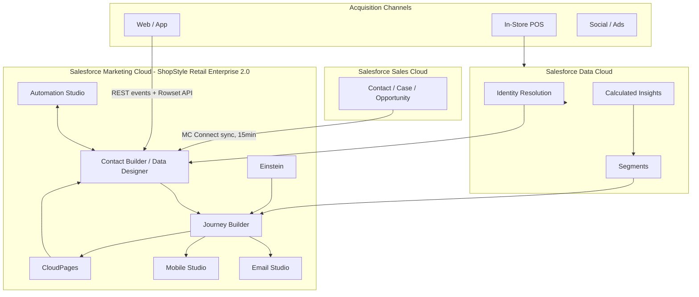
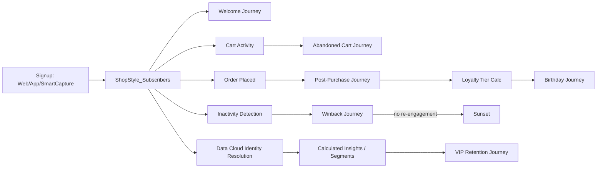
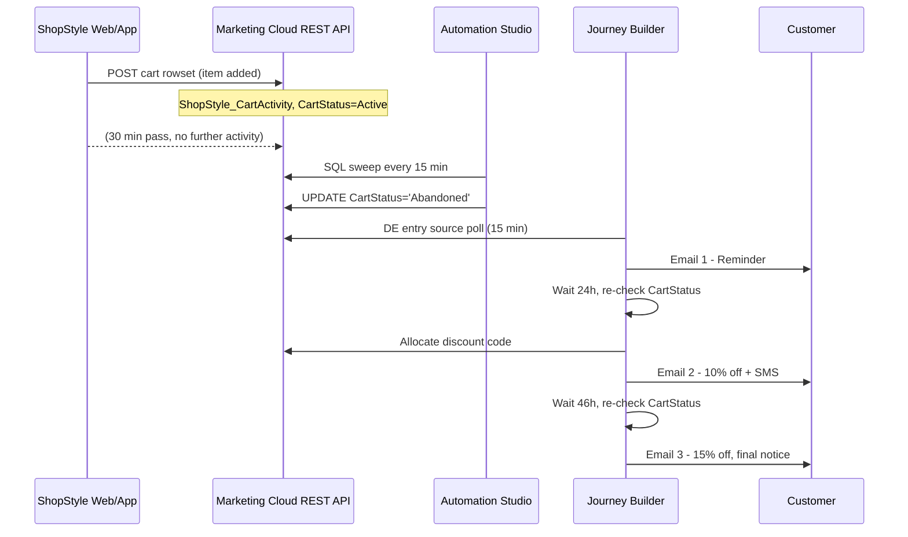

# Architecture

This is the consolidated architecture reference. Component-level detail lives in dedicated docs linked
throughout — this page is the map, not a duplicate of the territory.

## System Overview

Full Business Unit / role model: [`../architecture/business-units.md`](../architecture/business-units.md).

## Data Architecture

Contact model, Data Designer relationships, retention policy, and the full ER diagram:
[`../architecture/data-model.md`](../architecture/data-model.md).

## Data Flow — Signup to Retention

## Journey Architecture

Each journey has its own README with a Mermaid flow diagram, decision-split table, and exit-criteria
documentation:

- [Welcome](../journeys/welcome/README.md)
- [Abandoned Cart](../journeys/abandoned-cart/README.md)
- [Post-Purchase](../journeys/post-purchase/README.md)
- [Birthday/Loyalty](../journeys/birthday-loyalty/README.md)
- [Winback](../journeys/winback/README.md)
- [Case Escalation](../journeys/case-escalation/case-escalation-journey.json) (service, not marketing)
- [VIP Retention](../journeys/vip-retention/vip-retention-journey.json) (Data Cloud segment-driven)

## Sequence Diagram — Abandoned Cart Recovery (representative cross-system flow)

## Integration Architecture

Marketing Cloud Connect ↔ Sales Cloud: [`../mc-connect/README.md`](../mc-connect/README.md)
Salesforce Data Cloud ↔ Marketing Cloud: [`../data-cloud/README.md`](../data-cloud/README.md)
REST/SOAP API contracts: [`api-documentation.md`](api-documentation.md)

## Deliverability Architecture

Sender authentication, IP warm-up, bounce/complaint monitoring: [`../deliverability/README.md`](../deliverability/README.md),
[`../architecture/sender-authentication.md`](../architecture/sender-authentication.md),
[`../architecture/ip-warming-strategy.md`](../architecture/ip-warming-strategy.md).
