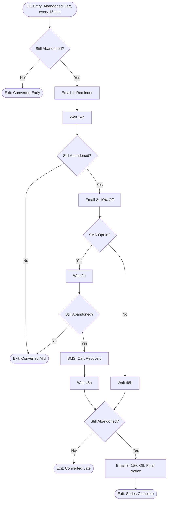

# Abandoned Cart Recovery Journey — ShopStyle US

Entry source: [`entry-source.json`](entry-source.json) — Data Extension entry, 15-minute recurring
schedule, filtered to `CartStatus = 'Abandoned' AND RecoveryEmailsSent = 0`.
Detection automation: [`../../automation-studio/sql/11-detect-abandoned-carts.sql`](../../automation-studio/sql/11-detect-abandoned-carts.sql).
Full canvas: [`abandoned-cart-journey.json`](abandoned-cart-journey.json).

## Flow Diagram



## REST APIs / Triggered Entry

Cart state is written in real time by the commerce platform via
[`../../api/rest/cart-events.md`](../../api/rest/cart-events.md) (Data Extension Rowset API against
`ShopStyle_CartActivity` + `ShopStyle_CartLineItems`). The journey itself does **not** use an API
Event trigger — it uses a **Data Extension entry source**, refreshed every 15 minutes by the
detection automation, which is the correct pattern for time-based (inactivity) triggers versus the
Welcome Journey's immediate API-event trigger.

## LookupRows / LookupOrderedRows Usage

Product blocks in all 3 emails use AMPscript against the normalized `ShopStyle_CartLineItems` DE:

```ampscript
SET @cartItems = LookupOrderedRows("ShopStyle_CartLineItems", 10, "AddedToCartDate DESC", "CartId", @cartId)
```

See [`../../ampscript/email/abandoned-cart-product-blocks.amp`](../../ampscript/email/abandoned-cart-product-blocks.amp)
for the full implementation, including a `Shared_ProductCatalog` join per line item for current price/
image/stock status (never trust the price snapshotted at add-to-cart time for the email display price —
always re-check current price and stock).

## Discount Logic

| Email | Discount | Code Pool `CampaignType` | Expiration |
|---|---|---|---|
| 1 | None (reminder only) | — | — |
| 2 | 10% off | `AbandonedCart10` | 7 days from allocation |
| 3 | 15% off | `AbandonedCart15` | 24 hours from allocation (urgency) |

Codes are allocated atomically at send time from `ShopStyle_DiscountCodePool` — see
[`../../ampscript/email/allocate-discount-code.amp`](../../ampscript/email/allocate-discount-code.amp).
Pool replenishment: [`../../automation-studio/sql/12-replenish-discount-pool.sql`](../../automation-studio/sql/12-replenish-discount-pool.sql).

## SMS

`SMS-SEND-CART` only fires for `SMSOptIn = true` subscribers, 2 hours after Email 2, and only if the
cart is still abandoned at that point (re-checked to avoid sending a redundant nudge to a converted
shopper). Message body and keyword program: see `abandoned-cart-journey.json` → `SMS-SEND-CART`.

## Exit Conditions

- Journey-level: unsubscribe / `EmailOptIn = 0` (checked continuously).
- Per-step re-checks at every wait boundary confirm `CartStatus` — a shopper who converts mid-series
  exits immediately rather than receiving a discount code for an item they already bought.
- Natural completion after Email 3 → `EXIT-SERIES-COMPLETE`.

## Testing

[`../../tests/journey-tests/abandoned-cart-test-plan.md`](../../tests/journey-tests/abandoned-cart-test-plan.md)
