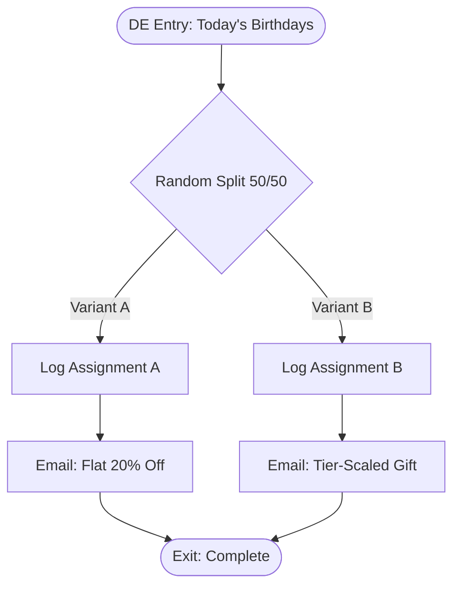

# Birthday Reward Journey — ShopStyle US

Entry: daily Data Extension source, populated by
[`../../automation-studio/sql/15-detect-birthdays.sql`](../../automation-studio/sql/15-detect-birthdays.sql).
Loyalty tier used for personalization comes from the nightly
[`../../automation-studio/sql/14-recalculate-loyalty-tiers.sql`](../../automation-studio/sql/14-recalculate-loyalty-tiers.sql)
recalculation (Bronze / Silver / Gold / Platinum, thresholds by trailing-12-month spend).

## Flow Diagram

## Loyalty Tier Logic

| Tier | Trailing 12-Month Spend | Perks Referenced in Variant B |
|---|---|---|
| Bronze | $0 – $499 | 1 pt/$1, birthday gift: 15% off |
| Silver | $500 – $1,999 | 1.25 pt/$1 + free shipping, birthday gift: 20% off + free shipping |
| Gold | $2,000 – $4,999 | 1.5 pt/$1 + early access, birthday gift: 25% off + free gift wrap |
| Platinum | $5,000+ | 2 pt/$1 + concierge support, birthday gift: 30% off + surprise gift |

Full calculation: `automation-studio/sql/14-recalculate-loyalty-tiers.sql`.

## Random Split A/B Test

`RANDOM-SPLIT-AB` is a native Journey Builder **Random Split** (50/50), not a decision based on
subscriber attributes — every birthday entrant has an equal, independent chance of either creative.
Each path logs its assignment to `ShopStyle_ABTestResults` **before** sending, so open/click/conversion
performance can be joined back to variant even if the email itself is later deleted from Email Studio.

Result analysis: [`../../sql/reporting/ab-test-results.sql`](../../sql/reporting/ab-test-results.sql).

## Testing

[`../../tests/journey-tests/birthday-loyalty-test-plan.md`](../../tests/journey-tests/birthday-loyalty-test-plan.md)
