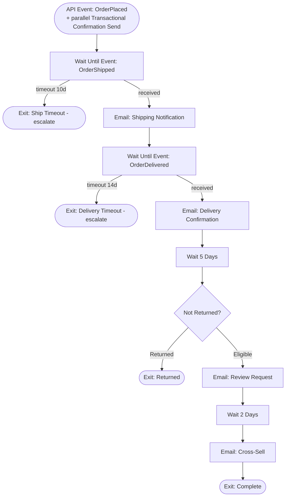

# Post-Purchase Lifecycle Journey — ShopStyle US

Order confirmation is a **Transactional Send** (immediate, guaranteed — see
[`../../api/rest/transactional-send.md`](../../api/rest/transactional-send.md)), fired in parallel with
this journey's `APIEvent-OrderPlaced` entry. Journey Builder owns everything after checkout:

## Transactional APIs

- Order confirmation: [`../../api/rest/transactional-send.md`](../../api/rest/transactional-send.md)
- Shipping / delivery / return webhooks: [`../../api/rest/order-status-events.md`](../../api/rest/order-status-events.md)
- Missed-webhook safety net: [`../../automation-studio/sql/13-order-status-timeout-fallback.sql`](../../automation-studio/sql/13-order-status-timeout-fallback.sql) + [`../../ssjs/automation/fire-fallback-events.ssjs`](../../ssjs/automation/fire-fallback-events.ssjs)

## Triggered Sends vs. Journey Sends

| Message | Delivery Mechanism | Why |
|---|---|---|
| Order Confirmation | Transactional Messaging API | Must be instant and guaranteed regardless of journey queue depth |
| Shipping / Delivery / Review / Cross-sell | Journey Builder `EmailSend` | Timing depends on external, unpredictable events (carrier updates), best modeled as journey waits |

## Cross-Sell Personalization

`EMAIL-CROSS-SELL` uses [`../../ampscript/email/cross-sell-recommendations.amp`](../../ampscript/email/cross-sell-recommendations.amp),
which joins the order's purchased categories (`ShopStyle_OrderLineItems` → `Shared_ProductCatalog`)
to recommend complementary, **not duplicate**, products (same category, different SKU, price-tier
adjacent).

## Exit Conditions

- `EXIT-SHIP-TIMEOUT` / `EXIT-DELIVERY-TIMEOUT`: no carrier event within SLA — these are logged for
  operational follow-up, not silent drops (see [`docs/runbook.md`](../../docs/runbook.md#post-purchase-timeouts)).
- `EXIT-RETURNED`: order returned before the review-request checkpoint — skips review ask and cross-sell
  (asking someone to review/rebuy an item they just returned is a poor experience).
- `EXIT-COMPLETE`: full lifecycle delivered.
- Journey-level: unsubscribe / suppression, checked continuously.

## Testing

[`../../tests/journey-tests/post-purchase-test-plan.md`](../../tests/journey-tests/post-purchase-test-plan.md)
