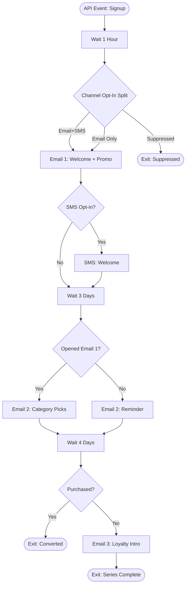

# Welcome Journey — ShopStyle US

Full canvas definition: [`welcome-journey.json`](welcome-journey.json)
Entry event: [`entry-event-definition.json`](entry-event-definition.json)
API contract for triggering entry: [`../../api/rest/event-signup.md`](../../api/rest/event-signup.md)

## Flow Diagram



## Personalization

- **AMPscript** dynamic content in Email 2 pulls the subscriber's top 2 preferred categories from
  `ShopStyle_Preferences` and joins to `Shared_ProductCatalog` for a 4-product recommendation grid
  (see [`ampscript/email/welcome-product-recommendations.amp`](../../ampscript/email/welcome-product-recommendations.amp)).
- Subject lines and promo code use Journey Builder personalization strings resolved against the
  `ShopStyle_Subscribers` and `Welcome_Journey_Entry` contact attributes.

## Decision Splits

| Split | Branches | Logic |
|---|---|---|
| Channel Opt-In | Email+SMS / EmailOnly / Suppressed | `EmailOptIn` / `SMSOptIn` flags |
| SMS Opt-in Check | SMSEligible / SMSNotEligible | `SMSOptIn` flag |
| Engagement (Email 1) | Engaged / NotEngaged | `_Open` system data view lookup |
| Purchase Check | Purchased / NotPurchased | `ShopStyle_Orders` existence since journey entry |

## Exit Criteria

Journey-level exit (evaluated continuously, removes contact regardless of current activity):

```sql
SELECT SubscriberKey FROM ShopStyle_Subscribers
WHERE SubscriberStatus = 'Unsubscribed' OR EmailOptIn = 0
```

Plus explicit `JourneyExit` activities: `Converted to Purchase`, `Series Complete`, `Suppressed/Opted Out`.

## Testing

See [`../../tests/journey-tests/welcome-journey-test-plan.md`](../../tests/journey-tests/welcome-journey-test-plan.md)
for entry-event test payloads, decision-split test matrix, and expected email/SMS outcomes.
