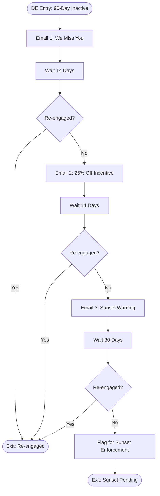

# Winback / Re-engagement Journey — ShopStyle US

Entry: weekly Data Extension source, `InactivityTier = 'Tier1_90Day'` only — see
[`entry-source.json`](entry-source.json). Detection:
[`../../automation-studio/sql/16-detect-inactive-subscribers.sql`](../../automation-studio/sql/16-detect-inactive-subscribers.sql)
using the **System Data Views** `_Sent`, `_Open`, `_Click`.

## Flow Diagram

## Inactive Subscriber Detection (System Data Views)

`_Sent`, `_Open`, `_Click` are joined to compute `DaysSinceEngagement` per subscriber, bucketed into
`Tier1_90Day` / `Tier2_180Day` / `Sunset`. Only `Tier1_90Day` triggers a **new** journey entry — a
subscriber already progressing through the series naturally reaches the 180-day and sunset messaging
via the journey's own wait/decision cadence, so the weekly detection job does not re-enter them and
create a duplicate, out-of-sync series.

## Sunset Logic

A subscriber who does not re-engage across all three touches (90d → 104d → 118d → 148d, ~10 weeks
total) is flagged by the journey's final `SQLQuery` activity (`WINBACK-LOG-SUNSET`), then physically
sunset by [`../../automation-studio/sql/17-sunset-inactive-subscribers.sql`](../../automation-studio/sql/17-sunset-inactive-subscribers.sql):

- `SubscriberStatus` → `'Sunset'` (distinct from `'Unsubscribed'` — preserves the fact this was a
  policy-driven suppression, not an explicit opt-out, relevant for future re-permission campaigns).
- `EmailOptIn` → `0` (fully suppressed from all future sends).
- A `ShopStyle_ConsentLog` entry is written (`ConsentSource = 'WinbackSunsetPolicy'`) for audit.

This protects sender reputation (see [`../../architecture/ip-warming-strategy.md`](../../architecture/ip-warming-strategy.md))
by ensuring chronically unengaged addresses stop receiving mail rather than silently dragging down
inbox placement indefinitely.

## Testing

[`../../tests/journey-tests/winback-test-plan.md`](../../tests/journey-tests/winback-test-plan.md)
