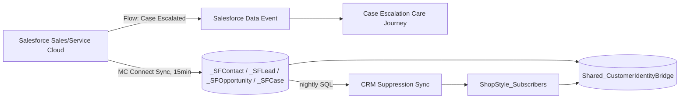

# Marketing Cloud Connect ↔ Sales Cloud

| Topic | Document |
|---|---|
| OAuth / Installed Packages | [`oauth-config.md`](oauth-config.md) |
| Synchronized Data Sources (Contact/Lead/Opportunity/Case) | [`synchronized-data-sources.md`](synchronized-data-sources.md) |
| Journey entry from Salesforce (Case Escalation) | [`salesforce-journey-entry.md`](salesforce-journey-entry.md) |
| REST API contracts | [`../api/rest/`](../api/rest/) |
| SOAP API contracts | [`../api/soap/`](../api/soap/) |

## Integration Summary

Sales Cloud is the system of record for CRM/service data; ShopStyle_Subscribers (Contact Builder) is
the system of record for marketing/commerce operational data. The two are bridged, not merged — see
[`synchronized-data-sources.md`](synchronized-data-sources.md) for the rationale.
